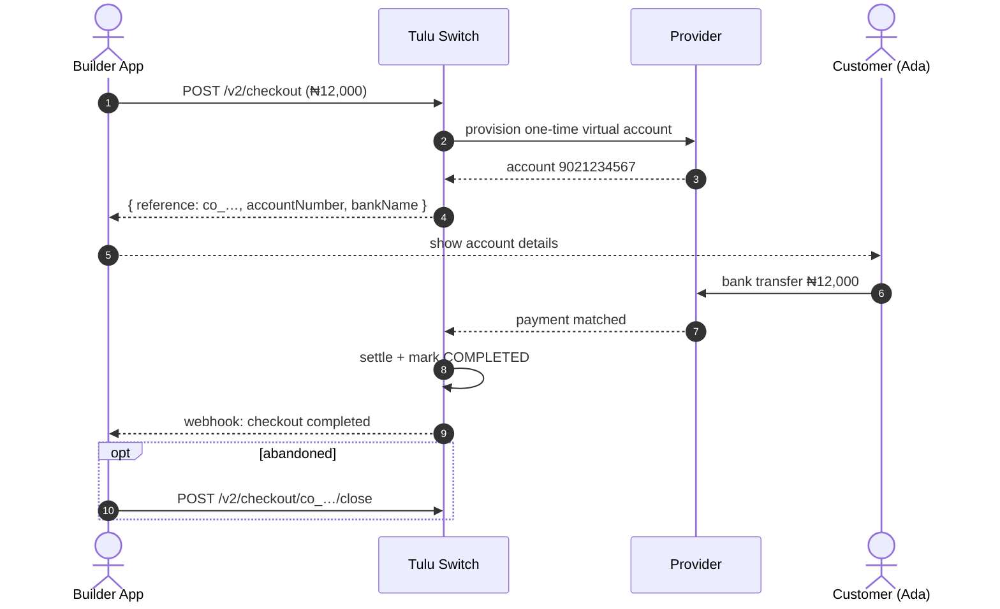

# Virtual Account (Checkout)

`POST /v2/checkout` · `GET /v2/checkout` · `GET /v2/checkout/:reference` · `POST /v2/checkout/:reference/close`

One-time **virtual bank accounts** for checkout: give the payer an account
number they can transfer to; the funds settle into your pool and are
reconciled automatically.

## Flow



## How it works

1. Create a checkout account — optionally pinned to a provider, or
   auto-selected. Some providers support accounts that **auto-settle** to
   your pool.
2. Show the returned account number to the payer.
3. They transfer money to it; Tulu Switch matches the payment and settles.
4. Poll status (`GET /v2/checkout/:reference`) or wait for webhooks; close
   early if the customer abandons.

## Scenario

Acme's checkout shows Ada a one-time account instead of a card form:

```
POST /v2/checkout
{ "currency": "NGN", "amount": 12000,
  "email": "ada.obi@example.com", "reference": "ord_001" }
→ { "accountNumber": "9021234567", "bankName": "Paystack-Titan",
    "reference": "co_…", "status": "ACTIVE" }
```

Ada sends ₦12,000 from her banking app → the checkout flips to
`COMPLETED`, funds settle, and Acme's webhook fires. Order fulfilled.

## Notes

- List all checkout accounts with filters via `GET /v2/checkout`.
- Accounts are one-time; reuse requires creating a new one.
