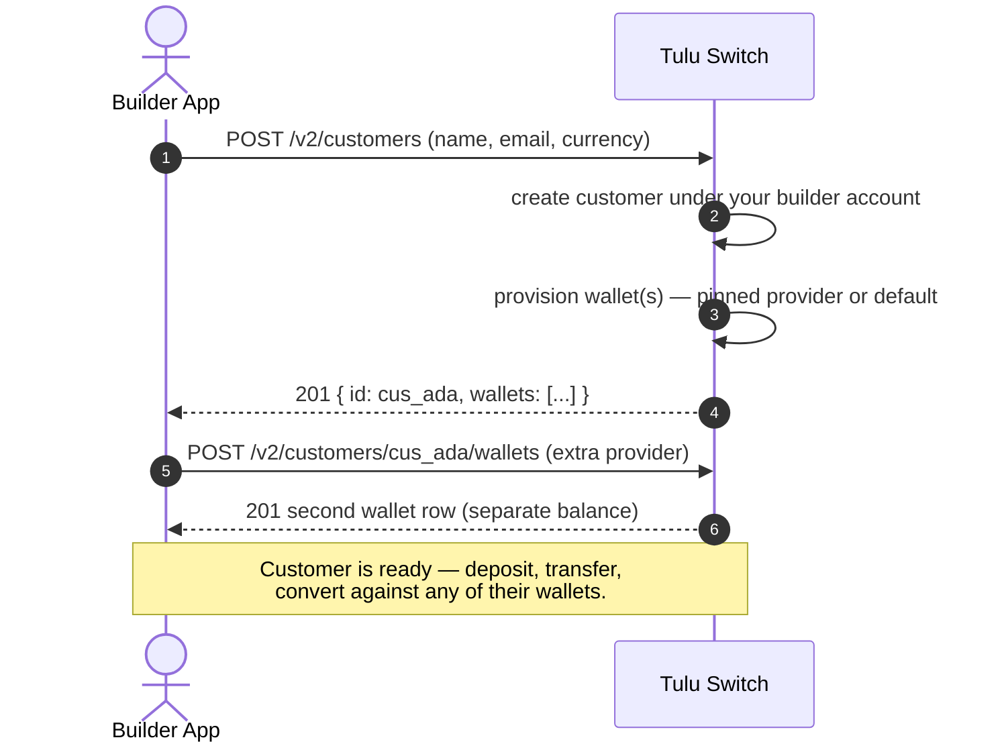

# Customers

A **customer** is a person or business that your application serves. Tulu
Switch keeps their identity, wallets and transaction history under your
builder account — you never share customers with other builders.

## Flow



## Endpoints

| Method | Path | Purpose |
|---|---|---|
| POST | `/v2/customers` | Create a customer |
| GET | `/v2/customers` | List customers (paginated) |
| GET | `/v2/customers/currencies` | Supported currencies |
| GET | `/v2/customers/:id` | Get one customer |
| PATCH | `/v2/customers/:id` | Update a customer |
| DELETE | `/v2/customers/:id` | Remove a customer |
| POST | `/v2/customers/:id/wallets` | Add a wallet to the customer |
| GET | `/v2/customers/:id/wallets` | List their wallets |
| DELETE | `/v2/customers/:id/wallets/:walletId` | Deactivate a wallet |
| GET | `/v2/customers/:id/providers?currency=NGN` | Providers available to them |
| GET | `/v2/customers/:id/transactions` | Their transactions |
| GET | `/v2/customers/:id/transactions/:reference` | One transaction |

## How it works

Creating a customer can optionally provision wallets in the same call:

- **Minimal** — name + email. Add wallets later.
- **Pinned** — pass `provider` to open the wallet with one specific provider.
- **Full** — country, channel, metadata.

Wallets are held **per provider**: the same customer can hold NGN via
Paystack *and* NGN via Flutterwave as two separate balances. That is what
enables automatic provider selection on money movement.

## Scenario

Acme signs up Ada and immediately opens her NGN wallet:

```
POST /v2/customers
{ "firstName": "Ada", "lastName": "Obi", "email": "ada.obi@example.com",
  "country": "NG", "channel": "WALLET", "currency": "NGN" }
→ { "id": "cus_ada", "wallets": [{ "id": "cwlt_001", "providerName": "Paystack",
     "currency": "NGN", "balance": "0" }] }
```

Months later Acme adds a second NGN rail for redundancy:

```
POST /v2/customers/cus_ada/wallets
{ "channel": "WALLET", "currency": "NGN", "provider": "Flutterwave" }
```

Ada now has two NGN balances. From here every money-movement endpoint works
without her (or Acme) naming a provider — see [Wallets](../wallets/Bank%20Transfer.md).
