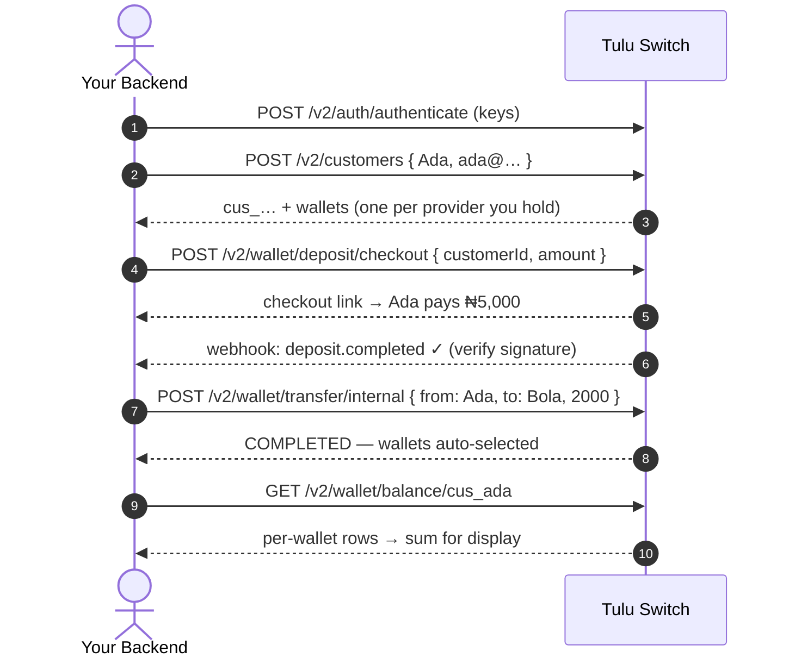

# Getting Started

Everything you need to go from zero to your first successful money movement:
authenticate, create a customer, fund them, move money, and track the result.

## Base URL & OpenAPI

All v2 endpoints live under `/v2`. Every deployment also serves interactive
Swagger docs at `/docs` — every guide here links the exact paths, so you can
try each call from the browser.

## Step 1 — Authenticate

Every v2 route expects `Authorization: Bearer <accessToken>`. Exchange your
key pair for a token:

```
POST /v2/auth/authenticate
{ "publicKey": "pk_test_abc123", "secretKey": "sk_test_xyz789", "expiresIn": 3600 }
→ { accessToken, refreshToken, tokenType: "Bearer", expiresIn: 900, environment: "TEST" }
```

- Access tokens are short-lived (**15 min default**, 24 h max via `expiresIn`)
- Refresh with `POST /v2/auth/refresh` — no re-authentication for 7 days
- `secretKey` is server-side only; never ship it to a browser or mobile app

## Step 2 — Know which environment you're in

There is no environment header or query param: **the key pair decides**.
`pk_test_/sk_test_` keys mint tokens stamped `TEST`; `pk_live_/sk_live_`
mint `LIVE`. TEST and LIVE data (customers, wallets, balances) are fully
separate — a wallet created in TEST simply doesn't exist in LIVE.

Do your whole integration in TEST first; going live is just swapping keys.

## Step 3 — Understand the model

```text
Builder (you)
└── Customers          ← your end users, unique email per builder
    └── Wallets        ← one per provider × currency (e.g. Paystack NGN + Flutterwave NGN)
        └── Balance    ← the money itself

Providers              ← the rails that process payments (Paystack, Flutterwave, …)
Treasury / pool        ← mirrors customer funds at each provider behind the scenes
```

One rule drives everything: **if you don't pass a provider, Tulu Switch picks
the wallet for you** — richest covering balance, splitting across wallets
where supported. See [Picking a provider](../README.md#picking-a-provider--both-paths).

## Step 4 — The golden path



The same shape applies whichever money movement you integrate — deposits,
bank payouts, internal/external transfers, conversions — authenticate once,
address customers by id, let auto-selection pick rails.

## Errors & retries

Errors come back uniform:

```jsonc
{ "statusCode": 400, "message": "Insufficient balance. Available: …", "error": "Bad Request" }
```

| Status | Meaning | What to do |
|---|---|---|
| `400` | Bad request / business rule (insufficient balance, mismatched providers) | Fix the request — never blindly retry |
| `401` | Missing/expired access token | Refresh the token, retry |
| `404` | Customer/wallet/batch not found | Check ids — don't retry |
| `409` | Idempotency conflict (`requestReference` reused) | Treat as success — the original request went through |
| `5xx` / network timeout | Unknown outcome | **Safe to retry with the same `requestReference`** |

Idempotency conventions:

- Money-movement endpoints accept an optional `requestReference` (single) /
  batch-level `requestReference` (bulk) — make it unique per logical payment,
  e.g. `invoice_0042_payout`
- Reusing a key returns `409` **instead of moving money twice** — build your
  retry logic around this
- Bulk endpoints validate all-or-nothing: a `400` lists every invalid item by
  `index`, and nothing moved

## Going-live checklist

- [ ] Whole flow works in TEST with test keys
- [ ] Webhook endpoint verifies signatures (see [Webhooks](../webhooks/Webhooks.md))
- [ ] Retries send the same `requestReference`; `409` handled as success
- [ ] Balances rendered by summing wallet rows (see [Unified Customer Balance](../use-cases/Unified-Customer-Balance.md)) if you show one number
- [ ] Swap `sk_test_`/`pk_test_` for live keys — everything else stays identical
