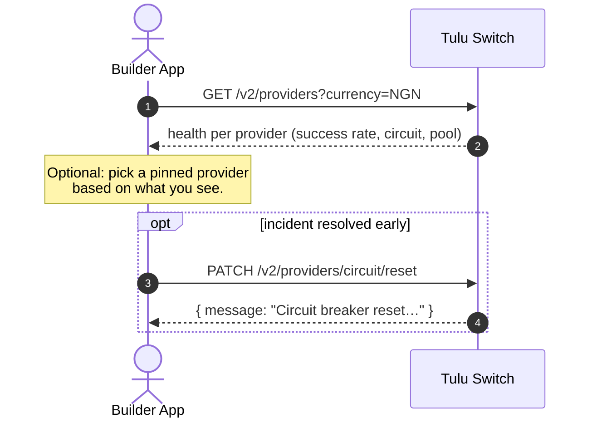

# Providers

Providers are the payment rails (Paystack, Flutterwave, Seerbit) that back
wallets, checkouts and payouts. These endpoints are **read-mostly**: check
who supports what, how healthy they are, and reset circuit breakers.

## Flow



## Endpoints

| Method | Path | Purpose |
|---|---|---|
| GET | `/v2/providers/supported?currency=NGN` | Enabled providers + currencies |
| GET | `/v2/providers` | Health report per provider+currency |
| GET | `/v2/providers/:name` | Health for one provider |
| GET | `/v2/providers/analytics` | Counts, success rates, volumes |
| GET | `/v2/providers/selected` | Providers *you* have wallets with |
| PATCH | `/v2/providers/circuit/reset` | Force-reset a circuit breaker |

## Health statuses

| Status | Meaning |
|---|---|
| `healthy` | Success rate ≥ 99%, circuit closed |
| `degraded` | Success rate < 99% |
| `circuit_open` | Too many failures; auto-resets after 30 min |
| `no_pool` | No liquidity pool configured for the currency |

## How selection uses this

The auto-selection you see on [deposits](../wallets/Deposit.md) and
[transfers](../wallets/Bank%20Transfer.md) is driven by this data:

- **Deposits** — avoid open circuits, then best success rate.
- **Bank payouts / internal transfers** — balance-ranked wallets; provider
  health matters via circuit breakers on the rails themselves.

## Scenario

Before a big payroll run, Acme checks rail health:

```
GET /v2/providers?currency=NGN
→ [
    { "providerName": "Paystack",    "status": "healthy", "successRate": 97.75 },
    { "providerName": "Flutterwave", "status": "circuit_open", … }
  ]
```

Flutterwave's circuit is open — but Acme doesn't need to do anything:
payouts auto-avoid it, and it self-resets in 30 minutes. Only after an
incident is *fully* resolved would they force it:

```
PATCH /v2/providers/circuit/reset
{ "providerName": "Flutterwave", "currency": "NGN" }
```
