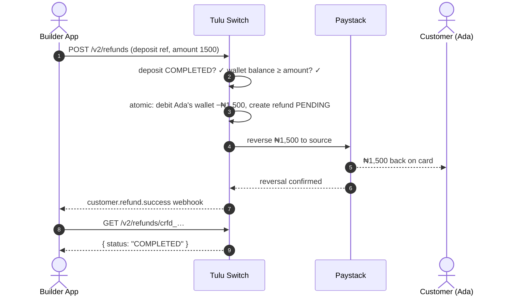

# Refund

`POST /v2/refunds` · `GET /v2/refunds/:reference` · `GET /v2/refunds`

Return a completed **WALLET deposit** to the customer's payment source —
full or partial.

## Flow



## How it works

- Refund by the **original deposit reference** (`cdep_…`).
- Full refund: omit `amount`. Partial: pass `amount`.
- The original provider is reused — the money goes back the way it came.
- The customer's wallet is debited by the refunded amount; if their balance
  is insufficient, the refund fails rather than going negative.
- Track status via `GET /v2/refunds/:reference`; list with filters by
  customer or status.

## Scenario

Ada deposited ₦5,000, then asked for ₦1,500 back after cancelling part of
an order:

```
POST /v2/refunds
{ "customerId": "cus_ada",
  "reference": "cdep_1721375800000_abc123",
  "amount": 1500,
  "reason": "Partial cancellation" }
→ { "reference": "crfd_…", "status": "pending", "amount": 1500 }
```

Behind the scenes: Ada's wallet −₦1,500 → Paystack reverses ₦1,500 to her
card/bank → webhook confirms. A full refund would omit `amount` and return
the entire ₦5,000.

## Notes

- Only **completed** deposits can be refunded; pending/failed ones cannot.
- Failed provider reversals mark the refund `FAILED` and re-credit the
  customer's wallet automatically.
