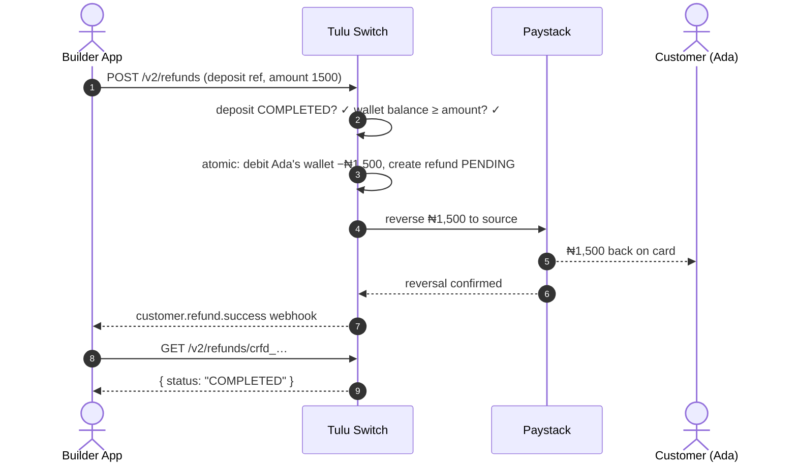

# Refund

`POST /v2/refunds` · `GET /v2/refunds/:reference` · `GET /v2/refunds`

Return a completed **WALLET deposit** to the customer's payment source —
full or partial.

## Flow



## How it works

- Refund by the **original deposit reference** (`cdep_…`).
- Full refund: omit `amount`. Partial: pass `amount`.
- The original provider is reused — the money goes back the way it came.
- The customer's wallet is debited by the refunded amount; if their balance
  is insufficient, the refund fails rather than going negative.
- Track status via `GET /v2/refunds/:reference`; list with filters by
  customer or status.

## Scenario — partial refund of a cancelled order

Ada deposited ₦5,000 (reference `cdep_1721375800000_abc123`), then
cancelled part of her order. Acme's support tool issues ₦1,500 back:

```
POST /v2/refunds
{ "customerId": "cus_ada",
  "reference": "cdep_1721375800000_abc123",   ← the ORIGINAL deposit ref
  "amount": 1500,
  "reason": "Partial cancellation" }
→ 201 { "reference": "crfd_1721375800000_r01",
        "status": "pending", "amount": 1500 }
```

Step by step:

1. **Immediately** — Ada's wallet −₦1,500, refund row created `PENDING`
2. **Provider side** — Paystack reverses ₦1,500 to her original card/bank
   (the money returns the way it came; Acme never handles card details)
3. **Confirmation** — `customer.refund.success` webhook → status
   `COMPLETED`; or poll `GET /v2/refunds/crfd_1721375800000_r01`

A full refund would omit `amount` and return the entire ₦5,000.

**Failure path:** if Paystack can't reverse (card expired, bank refused),
the refund flips to `FAILED` and **Ada's wallet is re-credited ₦1,500
automatically** before `customer.refund.failed` fires. Acme should surface
a "refund failed, money back in wallet" state rather than retrying blindly.

**Edge cases:**

- Refunding an already-refunded deposit? Partial amounts stack until the
  total refunded reaches the deposit amount — then further attempts fail.
- Ada spent the money? The refund is rejected up front (`400`) — Tulu Switch
  never drives a wallet negative. If the funds are gone, top the wallet up
  first or resolve the case manually with the provider.

**What Ada sees:** "₦1,500 refunded to your card — 1–3 business days."

## Notes

- Only **completed** deposits can be refunded; pending/failed ones cannot.
- Failed provider reversals mark the refund `FAILED` and re-credit the
  customer's wallet automatically.
