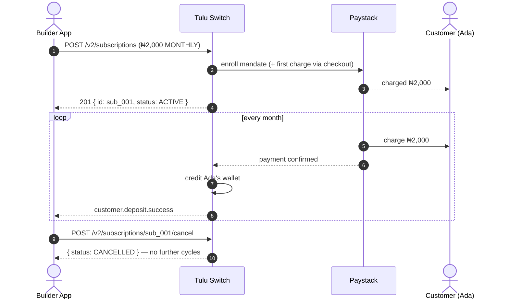

# Subscription

`POST /v2/subscriptions` · `GET /v2/subscriptions` · `GET /v2/subscriptions/:id` · `POST /v2/subscriptions/:id/cancel`

Recurring payments: charge a customer's wallet on a schedule (e.g. monthly
plan). Tulu Switch stores the plan; the **provider charges the customer each
cycle** — Switch creates and tracks the subscription, it doesn't run the
billing loop itself.

## Flow



## How it works

1. **Create** a subscription for a customer + wallet + amount + cycle.
   The target wallet must exist; an enrollment charge through checkout both
   collects the first payment and enrolls the mandate at the provider.
2. Each cycle, the provider charges the customer; successful charges credit
   the wallet and surface as normal deposit transactions/events.
3. **Cancel** any time — future cycles stop; completed charges are not
   reversed (use [Refunds](../refunds/Refund.md) for that).

## Scenario

Acme sells a ₦2,000/month plan. Ada subscribes:

```
POST /v2/subscriptions
{ "customerId": "cus_ada", "channel": "WALLET", "currency": "NGN",
  "amount": 2000, "cycle": "MONTHLY",
  "description": "Acme Premium" }
→ { "id": "sub_001", "status": "ACTIVE", … }
```

Every month Paystack charges Ada ₦2,000 → her wallet is credited → Acme's
webhook receives `customer.deposit.success`. When she downgrades:

```
POST /v2/subscriptions/sub_001/cancel
→ { "status": "CANCELLED" }
```
