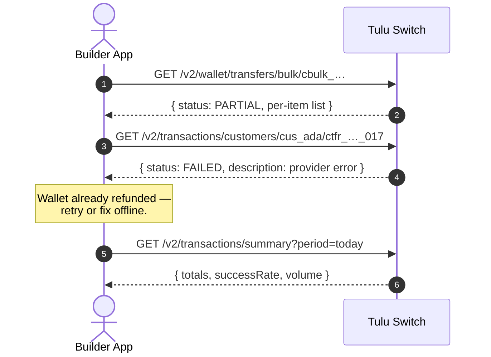

# Transactions

`GET /v2/transactions/summary` · `GET /v2/transactions/customers/:id` · `GET /v2/transactions/:reference`

Read-side of everything that moved: deposits, transfers, conversions,
refunds — with aggregates for dashboards.

## Flow



## Endpoints

| Method | Path | Purpose |
|---|---|---|
| GET | `/v2/transactions/summary` | Aggregates: totals, counts, volume |
| GET | `/v2/transactions/customers/:customerId` | One customer's history (paginated) |
| GET | `/v2/transactions/customers/:customerId/:reference` | Single transaction by reference |

## Transaction lifecycle

| Status | Meaning |
|---|---|
| `PENDING` | Created, awaiting provider (deposits) |
| `PROCESSING` | Debited and disbursing (bank payouts) |
| `COMPLETED` | Settled — balances have moved |
| `FAILED` | Provider failed; wallet already auto-refunded |

Split movements (see [Internal Transfer](../wallets/Internal%20Transfer.md))
write **one row per leg**, sharing a reference family:
`cint_…_out_0`, `cint_…_out_1`, `cint_…_in`.

## Scenario

After the payroll run, Acme reconciles. They pull the batch:

```
GET /v2/wallet/transfers/bulk/cbulk_1721375800000_abc123
→ { status: "PARTIAL", queued: 41, failed: 1, transfers: [...] }
```

Then drill into the one failure by its reference to read the provider error
and confirm the auto-refund landed on the employee's wallet.

For finance dashboards they poll the summary endpoint for daily volume and
success rates.
