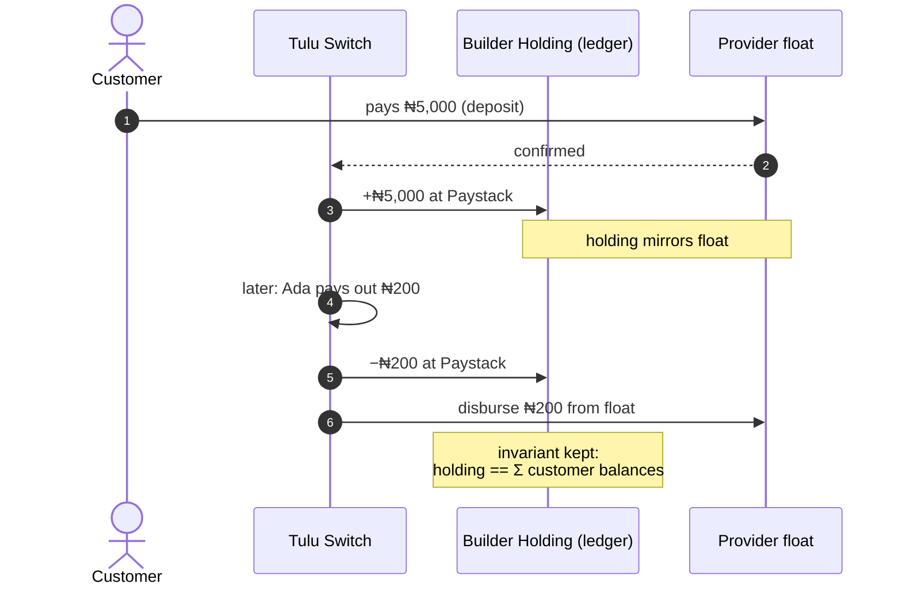

# Treasury Wallet

**Operator-facing concept.** The treasury is where a builder's aggregate
customer funds are tracked in the ledger — the mirror of all customer
balances. You interact with it indirectly: every customer deposit, payout,
transfer and conversion keeps it in sync automatically.

## Flow

On-chain treasury sources (pull-in / push-out of stablecoin float) are an
operator capability and not part of the builder-facing v2 API.

## What it does

- **Mirror of customer funds.** For every provider + currency, the builder's
  holding equals the sum of their customers' balances at that provider.
  Deposits credit it, payouts debit it, cross-provider movements rebook it.
- **Ring-fenced mode (treasury) vs purse.** Depending on the builder's
  configuration, customer funds are held in a ring-fenced treasury wallet or
  in the builder's purse. Movement logic is identical either way.
- **Per-provider books.** When an internal transfer or conversion moves
  money across providers, holdings are rebooked so per-provider totals never
  drift from what customers actually hold.

## What you see as a builder

You don't call treasury endpoints to move customer money — the wallet
endpoints do that. What you *can* observe:

- Balances per wallet: `GET /v2/wallet/balance/:customerId`
- Ledger entries on every movement (visible in transaction history)
- The `note` field on cross-provider internal transfers explaining the
  settlement position

## Scenario

Ada deposits ₦5,000 via Paystack → Acme's Paystack holding +₦5,000.
Ada pays John ₦200 → holding −₦200. Ada's ₦450 split transfer to Bola
(₦350 Flutterwave + ₦100 Paystack) → Flutterwave holding +₦450,
Paystack −₦100 net. At any moment:

> Acme's Paystack holding == Σ(customer balances at Paystack)

That invariant is why builders can trust wallet balances without reconciling
provider dashboards by hand.
