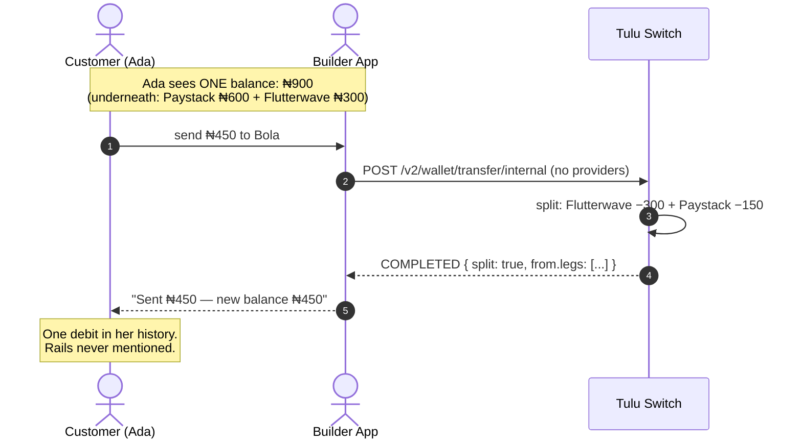

# Use Case — Unified Customer Balance

Show your customer **one** NGN balance in your app, even though Tulu Switch
holds it across several provider wallets. The customer never sees "Paystack"
or "Flutterwave" — you manage the rails, they see their money.

This is an integration **pattern**, not a separate feature: it composes
per-provider wallets, auto-selection and splitting — everything already in
the [Wallets](../wallets/Bank%20Transfer.md) guides.

## Flow



## The mental model

| Your app shows | Tulu Switch holds |
|---|---|
| Ada — NGN balance: **₦900** | `cwlt_ps` ₦600 via Paystack · `cwlt_fw` ₦300 via Flutterwave |

You own the unified number; Tulu Switch owns the per-provider truth. Every
movement keeps the two in sync automatically.

## Displaying one balance

`GET /v2/wallet/balance/:customerId` returns one row per provider wallet.
Sum them for display:

```text
₦600 (Paystack) + ₦300 (Flutterwave) = show ₦900
```

Cache briefly if you poll often; balances only change through movements or
webhooks.

## Moving money without naming rails

Always omit `provider` on movement endpoints:

- **Bank payouts** pick the richest covering wallet automatically.
- **Internal transfers & conversions** go further — if no single wallet
  covers the amount, the debit **splits** across wallets richest-first and
  the response tells you exactly how via `split` + `from.legs[]`.

Your UI never asks "which provider?" — the customer's action maps to one API
call regardless of how their money is distributed.

## Inflows with auto settlement

Three inflow rails, all ending in the same place — a rising unified balance:

- **Customer deposits** (`POST /v2/wallet/deposit`) credit the customer's
  wallet directly — specifically the wallet backed by the provider that
  processed the checkout. The unified balance rises immediately and
  automatically.
- **Customer-aware virtual accounts** (`POST /v2/checkout` with
  `customerId`) credit the linked customer's wallet automatically when money
  lands — same provider and currency as the account, `DEPOSIT` row included,
  `checkout.paid` webhook carries the `customerId`. Use this for bank-
  transfer-style checkouts that belong to a known customer.
- **Anonymous virtual accounts** (`POST /v2/checkout` without `customerId`)
  do **not** touch customer wallets: the account flips to `PAID`, you get
  `checkout.paid`, and funds settle into **your pool at that provider**.
  Attributing them to a customer's balance is your move.

Either way, settlement is booked against one builder-side provider wallet —
which rail handled it never reaches your customer's view.

## What to show, what to log

| Hide from customers | Keep in your records |
|---|---|
| `provider`, `walletId`, `autoSelected` | `reference` (idempotent trail) |
| per-leg splits | `from.legs[]` for reconciliation |
| circuit/health details | webhook events per movement |

Transaction history arrives as **one row per leg** (`cint_…_out_0`,
`cint_…_out_1`, `cint_…_in`). Group rows sharing a reference family before
rendering, so Ada sees *"Sent ₦450"* once — not two partial debits.

## Caveats

1. **Bank payouts need one wallet covering the full amount.** A customer
   showing ₦600 unified but split 300/300 cannot pay out ₦500 today — the
   request fails with the richest-balance error. Design around it: cap
   payout amounts at the richest rail, or top up that rail first with a
   deposit pinned to its provider.
2. **Splitting applies to book movements only** (internal transfers,
   conversions) — never to bank disbursements.
3. **History needs grouping** — ungrouped legs look like multiple charges.
