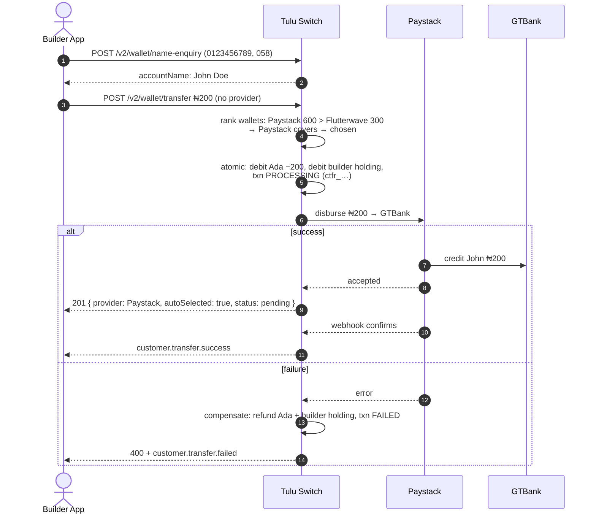

# Bank Transfer

`POST /v2/wallet/transfer` · `POST /v2/wallet/transfer/bulk`

Move money from a customer's wallet to an **external bank account**.

## Flow



## The one-provider rule

A bank payout always rides **exactly one provider** end to end. When you
omit `provider`, Tulu Switch picks it for you:

1. Rank the customer's active wallets (channel + currency) by balance.
2. Use the **first wallet that covers the full amount** — i.e. the richest
   wallet that can pay it alone.
3. No single wallet covers it → `400`, quoting the richest balance.
   **Bank payouts never split across providers.**

## Scenario — Ada pays her landlord ₦200

Ada holds ₦600 via Paystack and ₦300 via Flutterwave. Acme's payout form
collects the bank details and validates them first:

```
POST /v2/wallet/name-enquiry
{ "accountNumber": "0123456789", "bankCode": "058" }
→ { "accountName": "John Doe" }
```

Name matches what Ada entered → submit. **No provider is passed**, so Tulu
Switch picks the rail:

```
POST /v2/wallet/transfer
{ "customerId": "cus_ada", "channel": "WALLET", "currency": "NGN",
  "amount": 200, "accountNumber": "0123456789",
  "bankCode": "058", "accountName": "John Doe" }
→ 201 {
    "reference": "ctfr_1721375800000_abc123",   ← store for tracking
    "provider": "Paystack",                     ← auto-picked (600 ≥ 200)
    "walletId": "cwlt_001",
    "autoSelected": true,
    "status": "pending"
  }
```

What happened in the books: Ada −₦200 *and* Acme's Paystack holding −₦200;
the transaction sits `PROCESSING` until Paystack confirms.

**Completion path:** `customer.transfer.success` webhook arrives → status
flips to `COMPLETED` → Acme marks the payout sent.

```json
{ "event": "customer.transfer.success",
  "data": { "customerId": "cus_ada",
            "reference": "ctfr_1721375800000_abc123",
            "amount": 200, "currency": "NGN", "provider": "Paystack" } }
```

**Failure path:** if GTBank rejects or Paystack errors, the transaction
becomes `FAILED` **and Ada's ₦200 is already back in her wallet** before the
`customer.transfer.failed` event fires — Acme needs no compensation logic,
just a UI update.

**Edge case — no single wallet covers it:** paying ₦700 fails up front,
before any debit:

```json
{ "statusCode": 400, "message": "Insufficient balance. Richest wallet (Paystack) holds 600 NGN; requested: 700. Pass `provider` to pick a specific wallet." }
```

That's the one-provider rule: bank payouts never split, even though Ada's
combined balance is ₦900.

**What Ada sees:** "Sent ₦200 to John Doe ✓" — later replaced by a failure
notice with her balance restored if the rail rejects it.

## If the provider fails

Automatic compensation: the customer's wallet is refunded in full and the
transaction is marked `FAILED`. Nothing is left half-debited. You get a
`400` with the provider error, and `customer.transfer.failed` fires.

## Bulk payouts

`POST /v2/wallet/transfer/bulk` runs up to 200 payouts in one call:

- **All-or-nothing validation** — any invalid item rejects the whole batch
  with a per-item `errors` list, before anything is debited.
- **Per-item settlement** — each item uses its own selected provider; one
  failure refunds only that item.
- Idempotency via `requestReference` (duplicate → `409`).

Track batches: `GET /v2/wallet/transfers/bulk/:batchReference`.

## Constraints

- Blocked in TEST mode (real money at the provider).
- Fetch bank codes first: `GET /v2/wallet/banks?currency=NGN`; if you pin a
  provider there, reuse it for name-enquiry and transfer.
