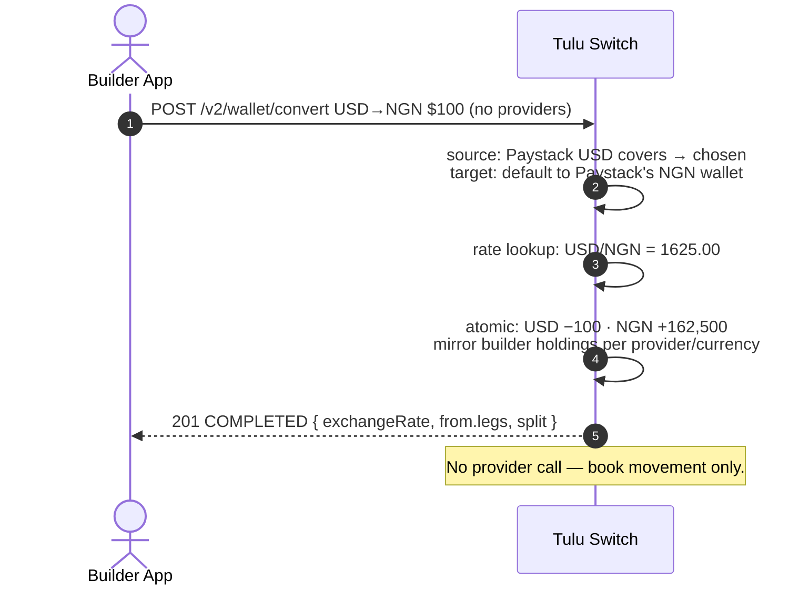

# Conversion

`POST /v2/wallet/convert`

Convert a customer's balance from one currency to another using the
platform exchange rate. Debit and credit post atomically — it completes
synchronously.

## Flow



## Selection rules

- **Source (`fromCurrency`)** — same as internal transfers: omit
  `fromProvider` and the richest covering wallet is used; if no single
  wallet covers but the combined does, the debit splits richest-first.
- **Target (`toCurrency`)** — defaults to the source's provider; if the
  customer holds no wallet there in the target currency, falls back to any
  active wallet they do have.
- Pin `fromProvider` / `toProvider` for exact control.

## Scenario

Ada has $100 in her USD Paystack wallet and wants Naira. She holds NGN via
Paystack *and* Flutterwave:

```
POST /v2/wallet/convert
{ "customerId": "cus_ada", "channel": "WALLET",
  "fromCurrency": "USD", "toCurrency": "NGN", "amount": 100 }
→ {
    "reference": "ccvt_1721375800000_abc123",
    "from": { "currency": "USD", "amount": "100",
              "provider": "Paystack", "autoSelected": true,
              "legs": [ { "walletId": "cwlt_usd", "provider": "Paystack", "amount": "100" } ] },
    "to":   { "currency": "NGN", "amount": "162500.00",
              "provider": "Paystack", "walletId": "cwlt_ngn_ps" },
    "exchangeRate": "1625.00",
    "split": false,
    "status": "COMPLETED"
  }
```

$100 → ₦162,500 lands in her Paystack NGN wallet instantly (target followed
the source's provider). If she had pinned `toProvider: "Flutterwave"`, the
Naira would land on her Flutterwave rail instead.

Split example: Ada converts $150 while holding $100 via Paystack + $50 via
Flutterwave:

```
POST /v2/wallet/convert
{ "customerId": "cus_ada", "channel": "WALLET",
  "fromCurrency": "USD", "toCurrency": "NGN", "amount": 150 }
→ 201 {
    "reference": "ccvt_1721375800000_def456",
    "from": { "currency": "USD", "amount": "150", "autoSelected": true,
              "legs": [
                { "walletId": "cwlt_usd_ps", "provider": "Paystack",    "amount": "100" },
                { "walletId": "cwlt_usd_fw", "provider": "Flutterwave", "amount": "50" } ] },
    "to":   { "currency": "NGN", "amount": "243750.00",
              "provider": "Paystack", "walletId": "cwlt_ngn_ps" },
    "exchangeRate": "1625.00",
    "split": true,
    "status": "COMPLETED"
  }
```

Both USD wallets drained; the full ₦243,750 landed on her Paystack NGN
wallet (target followed the first leg's provider). History shows one
CONVERSION row per leg — `ccvt_…` and `ccvt_…_leg1` — group them for
display, exactly like split internal transfers.

**What Ada sees:** "$150 → ₦243,750 converted ✓" — a single action, however
many wallets fed it.

## Errors

| Status | Cause |
|---|---|
| 400 | Same-currency conversion, insufficient balance, inactive wallet |
| 404 | Customer, wallet, or exchange rate not found |
