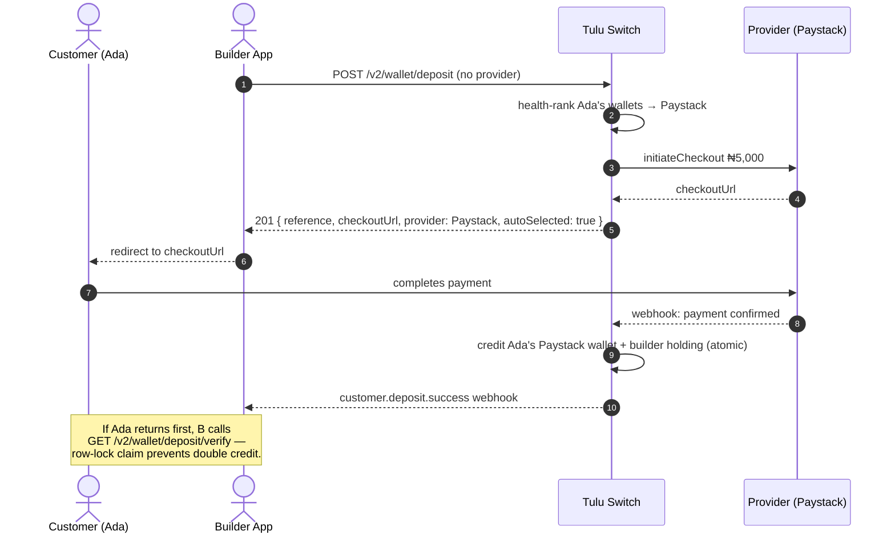

# Deposit

`POST /v2/wallet/deposit` · `GET /v2/wallet/deposit/verify`

Bring money **into** a customer's wallet. Tulu Switch creates a checkout
session with a payment provider; the customer pays there and the wallet is
credited automatically.

## Flow



## How the provider is chosen

Deposits are inbound, so balances don't drive the choice — you are choosing
**which provider processes the checkout**:

- You pass `provider` → that provider is used.
- You omit it and the customer has one wallet → that wallet's provider.
- You omit it and they have several → **health-ranked pick**: providers with
  open circuit breakers are avoided, then best success rate wins.

The response always tells you what was picked via `provider`, `walletId`
and `autoSelected`.

## Scenario

Acme tops up Ada's wallet with ₦5,000:

```
POST /v2/wallet/deposit
{ "customerId": "cus_ada", "channel": "WALLET", "currency": "NGN",
  "amount": 5000, "email": "ada.obi@example.com",
  "callbackUrl": "https://acme.app/callback" }
→ { "checkoutUrl": "https://checkout.paystack.com/xxx",
    "provider": "Paystack", "autoSelected": true, ... }
```

Ada pays on the Paystack page → her **Paystack wallet** is credited ₦5,000,
and `customer.deposit.success` fires to Acme's webhook URL.

## Confirming arrival (race-safe)

Two paths credit the wallet and they cannot double-credit:

1. **Webhook** fires when the provider confirms.
2. **Verify endpoint** — if Ada returns to the app before the webhook lands,
   call `GET /v2/wallet/deposit/verify?reference=…`. It claims the deposit
   under a row lock: whichever runs first credits once; the other becomes a
   no-op returning `status: "success"`.

Results: `success` · `pending` · `failed`.

## Notes

- Amounts are major units (`5000` = ₦5,000).
- Reusable card authorizations are stored automatically for future charges.
