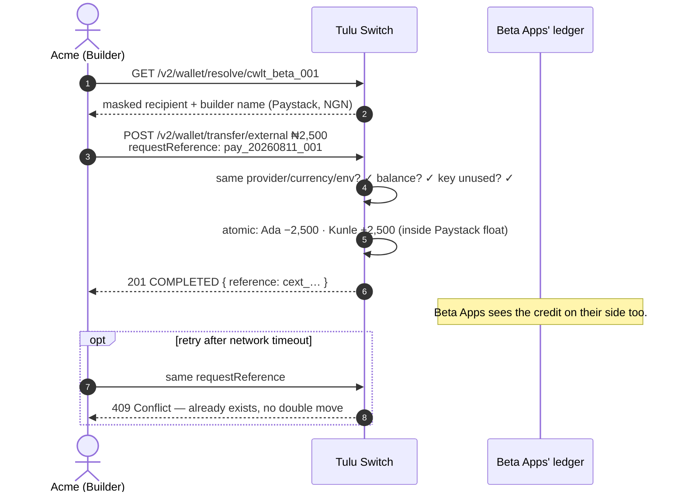

# External Transfer (Cross-Builder)

`POST /v2/wallet/transfer/external` · `POST /v2/wallet/transfer/external/bulk` · `GET /v2/wallet/resolve/:walletId`

Send money from your customer's wallet to a customer of **another builder**,
identified by wallet id.

## Flow



## Rules

- Both wallets must share **provider, channel, currency and environment** —
  the funds never leave that provider's float, so no provider call is made
  and it settles synchronously.
- Resolve first: `GET /v2/wallet/resolve/:walletId` returns masked recipient
  details (any builder's wallet, same environment) so you can confirm who
  you are paying.
- **Recipients are addressed by wallet id only.** You cannot look up another
  builder's customer by email or name — cross-builder responses mask PII
  (`a***@example.com`) by design. Collect the wallet id from the recipient
  (they see it in the other builder's app), then resolve it to confirm.
- Idempotency: pass `requestReference`; re-submitting the same key is
  rejected with `409` — never a double move.
- Cross-provider is intentionally **not** supported here; use internal
  transfers to reposition first.

## Scenario

Acme pays a supplier invoice. The supplier's staff are customers of another
builder, *Beta Apps*. Acme resolves the destination wallet first:

```
GET /v2/wallet/resolve/cwlt_beta_001
→ { walletId: cwlt_beta_001, provider: Paystack, currency: NGN,
    recipient: { firstName: "Kunle", lastName: "A****", email: "k***@…" },
    builder: { name: "Beta Apps" } }
```

Looks right → send ₦2,500 with an idempotency key:

```
POST /v2/wallet/transfer/external
{ "fromWalletId": "cwlt_ada_001", "toWalletId": "cwlt_beta_001",
  "amount": 2500, "narration": "Invoice INV-0042",
  "requestReference": "pay_20260811_001" }
→ { status: "COMPLETED", reference: "cext_…", … }
```

Kunle's wallet is credited instantly; both builders see the movement in
their transaction histories. If Acme retries the same
`requestReference`, they get `409` and no second move.

## Bulk

`POST /v2/wallet/transfer/external/bulk` pays up to 200 destination wallets
across any builders in one call:

```
POST /v2/wallet/transfer/external/bulk
{ "requestReference": "payouts_aug_01",
  "transfers": [
    { "fromWalletId": "cwlt_ada_001", "toWalletId": "cwlt_beta_001", "amount": 2500, "narration": "Invoice INV-0042" },
    { "fromWalletId": "cwlt_ada_001", "toWalletId": "cwlt_gamma_009", "amount": 1000 }
  ] }
→ { status: "COMPLETED", batchReference: "cbulk_…", transfers: [ … ] }
```

- Same rules as the single transfer, per item: both wallets must share
  **provider, channel, currency and environment**.
- **All-or-nothing validation** — if any item fails (unknown wallet,
  provider mismatch, insufficient balance), nothing moves and the `400`
  lists every invalid item by `index`.
- Balances are checked **across items**: one source wallet funding several
  transfers cannot collectively overdraw, even though each item would pass
  alone.
- Batch `requestReference` is idempotent (`409` on duplicate); track the
  batch with `GET /v2/wallet/transfers/bulk/:batchReference`.
