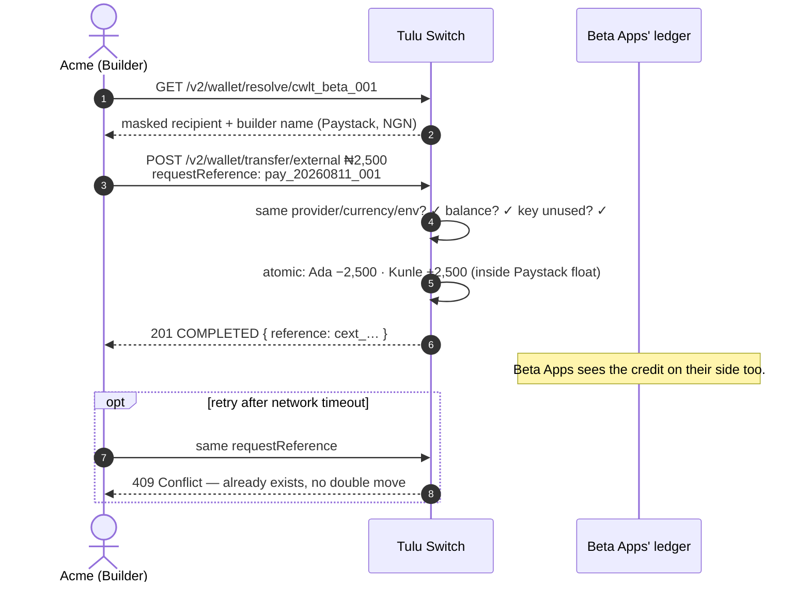

# External Transfer (Cross-Builder)

`POST /v2/wallet/transfer/external` · `GET /v2/wallet/resolve/:walletId`

Send money from your customer's wallet to a customer of **another builder**,
identified by wallet id.

## Flow



## Rules

- Both wallets must share **provider, channel, currency and environment** —
  the funds never leave that provider's float, so no provider call is made
  and it settles synchronously.
- Resolve first: `GET /v2/wallet/resolve/:walletId` returns masked recipient
  details (any builder's wallet, same environment) so you can confirm who
  you are paying.
- Idempotency: pass `requestReference`; re-submitting the same key is
  rejected with `409` — never a double move.
- Cross-provider is intentionally **not** supported here; use internal
  transfers to reposition first.

## Scenario

Acme pays a supplier invoice. The supplier's staff are customers of another
builder, *Beta Apps*. Acme resolves the destination wallet first:

```
GET /v2/wallet/resolve/cwlt_beta_001
→ { walletId: cwlt_beta_001, provider: Paystack, currency: NGN,
    recipient: { firstName: "Kunle", lastName: "A****", email: "k***@…" },
    builder: { name: "Beta Apps" } }
```

Looks right → send ₦2,500 with an idempotency key:

```
POST /v2/wallet/transfer/external
{ "fromWalletId": "cwlt_ada_001", "toWalletId": "cwlt_beta_001",
  "amount": 2500, "narration": "Invoice INV-0042",
  "requestReference": "pay_20260811_001" }
→ { status: "COMPLETED", reference: "cext_…", … }
```

Kunle's wallet is credited instantly; both builders see the movement in
their transaction histories. If Acme retries the same
`requestReference`, they get `409` and no second move.
