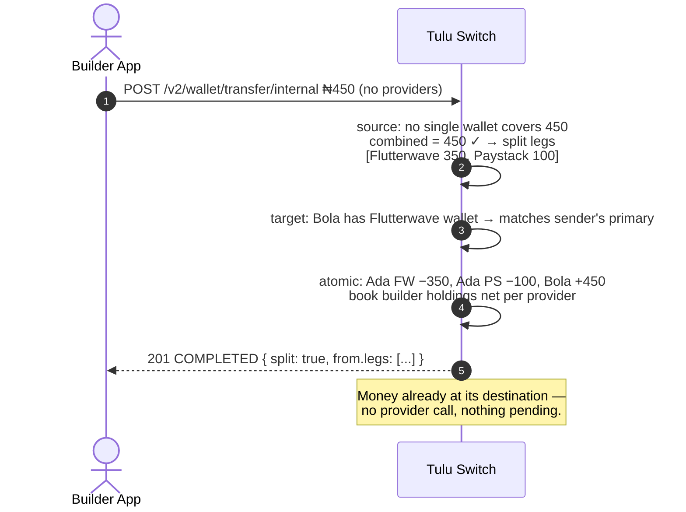

# Internal Transfer

`POST /v2/wallet/transfer/internal` · `POST /v2/wallet/transfer/internal/bulk`

Move balance between **two of your own customers**. No bank rails, no
provider call — it settles synchronously in the books and cannot fail
part-way.

## Flow



## Source selection — auto, with splitting

Omit `fromProvider` and the source resolves in three steps:

1. **Richest covering wallet wins** — one wallet covers the amount → done.
2. **Otherwise we split** — combined balances cover it but no single wallet
   does → the debit is spread greedily richest-first across wallets.
3. **Otherwise `400`** — quoting the richest *and* the combined total.

Pinning `fromProvider` disables splitting: that exact wallet must cover it.

## Destination selection — sender-first with fallback

The recipient defaults to the **sender's primary provider** (keeps the move
inside one provider). If they hold no wallet there, we fall back to their
richest active wallet instead of failing — the movement becomes
cross-provider (`crossProvider: true` + explanatory `note`). Pin
`toProvider` to disable the fallback.

## Finding recipients

Both sides are your own customers, so look them up in your own directory:

```
GET /v2/customers?search=bola@example.com
→ [{ id: "cus_bola", firstName: "Bola", … }]
```

- `search` is full-text across **name and email** — an email, a name, or a
  fragment all work
- Take `id` from the result as `fromCustomerId` / `toCustomerId`
- Want to preview balances first? `GET /v2/customers/:id` returns the
  customer with their wallets

There is no separate resolve endpoint for internal transfers — the transfer
itself resolves wallets server-side.

## Scenario — split

Ada owes Bola ₦450. Ada holds ₦100 via Paystack, ₦350 via Flutterwave — no
single wallet covers it, but together they do, so the debit splits. Acme's
app looks both customers up by email first (`GET /v2/customers?search=…`),
then:

```
POST /v2/wallet/transfer/internal
{ "fromCustomerId": "cus_ada", "toCustomerId": "cus_bola",
  "channel": "WALLET", "currency": "NGN", "amount": 450 }
→ 201 {
    "reference": "cint_1721375800000_abc123",
    "from": { "customerId": "cus_ada", "provider": "Flutterwave",
              "autoSelected": true,
              "legs": [
                { "walletId": "cwlt_002", "provider": "Flutterwave", "amount": "350" },
                { "walletId": "cwlt_001", "provider": "Paystack",    "amount": "100" } ] },
    "to":   { "customerId": "cus_bola", "provider": "Flutterwave",
              "walletId": "cwlt_bola_fw", "autoSelected": true },
    "split": true,
    "crossProvider": false,
    "status": "COMPLETED"
  }
```

Reading the response:

- `split: true` + `from.legs[]` — the money left Ada in two pieces,
  richest-first (Flutterwave 350, then Paystack 100)
- `to.autoSelected: true` — Acme never picked Bola's rail; the sender's
  primary provider matched her wallet
- Status is already `COMPLETED` — no webhooks to wait for; balances moved

History rows this creates (group them by the shared reference family when
displaying):

```
cint_…_out_0  Ada    TRANSFER −350  Flutterwave
cint_…_out_1  Ada    TRANSFER −100  Paystack
cint_…_in     Bola   DEPOSIT  +450  Flutterwave
```

**Edge cases:** combined balance short → `400` quoting richest *and*
combined totals; pinning `fromProvider: "Paystack"` would have failed —
pinned wallets must cover alone, no splitting.

**What Ada sees:** one notification — "Sent ₦450 to Bola ✓" — never two
debits.

## Bulk

`POST /v2/wallet/transfer/internal/bulk` moves up to 200 pairs in one call.
All-or-nothing validation; everything settles in one transaction;
`requestReference` idempotency (`409` on duplicate).
