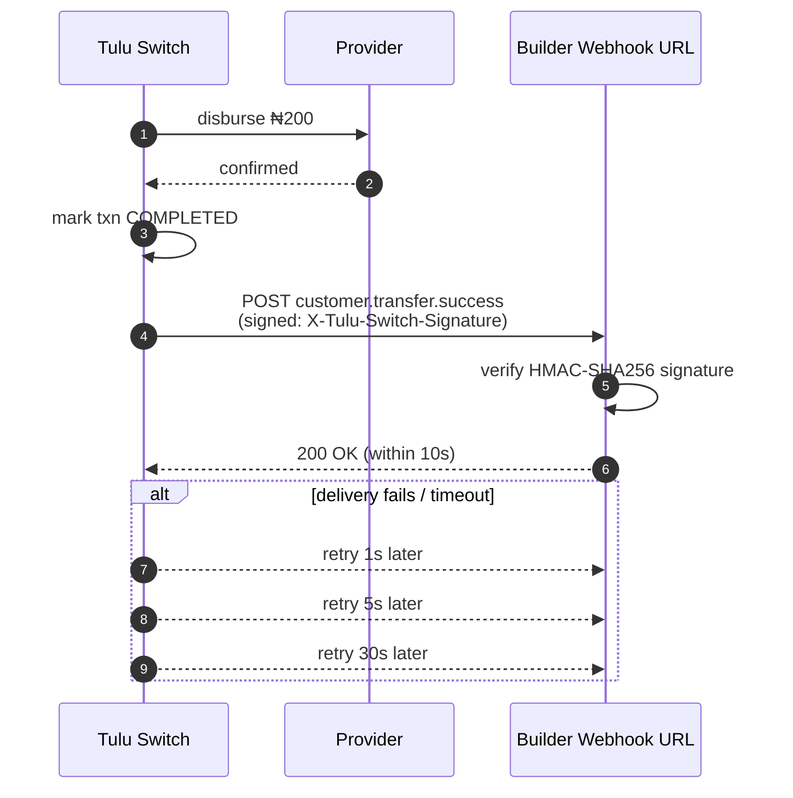

# Webhooks

Tulu Switch **POSTs events to your registered webhook URL** when customer
transactions complete. These are not endpoints you call — you receive them.

Register your URL at `POST /webhook/config` (Builder API).

## Flow



## Envelope

Every delivery carries three headers:

| Header | Purpose |
|---|---|
| `X-Tulu-Switch-Signature` | HMAC-SHA256 of the raw body, keyed with your webhook secret — **verify before processing** |
| `X-Tulu-Switch-Event` | Event name (matches the body's `event` field) |
| `X-Tulu-Switch-Timestamp` | ISO 8601 dispatch time |

Body shape:

```json
{
  "event": "customer.deposit.success",
  "data": {
    "customerId": "cus_ada",
    "reference": "cdep_1721375800000_abc123",
    "amount": 5000,
    "currency": "NGN",
    "channel": "WALLET",
    "provider": "Paystack",
    "providerRef": "pstk_txn_yyyyyyyyyy"
  },
  "timestamp": "2026-07-26T09:01:00.000Z"
}
```

## Events

| Event | Fired when |
|---|---|
| `customer.deposit.success` | Deposit confirmed; wallet already credited |
| `customer.deposit.failed` | Deposit did not complete |
| `customer.transfer.success` | Bank payout confirmed at the provider |
| `customer.transfer.failed` | Payout failed (wallet already auto-refunded) |
| `customer.conversion.success` | Currency conversion completed |

## Delivery rules

- Respond **2xx within 10 seconds** to acknowledge.
- Failures retry up to **3 times** with exponential back-off
  (1 s → 5 s → 30 s).
- Events are informational-but-authoritative: by the time a success event
  arrives, balances have already moved.

## Scenario — payroll, handled correctly

Acme runs payroll: 40 bank payouts via
`POST /v2/wallet/transfer/bulk`. The batch returns `COMPLETED` with a
`batchReference`, but per-item provider confirmations still arrive as
webhooks. Their handler does three things, in order:

```text
1. VERIFY   recompute HMAC-SHA256 over the raw body with the webhook secret;
            mismatch → drop (respond 200 anyway to stop retries)
2. IDEMPOTENT UPDATE   upsert on data.reference:
            seen before → acknowledge and do nothing else
3. ACT      customer.transfer.success → mark payroll item paid
            customer.transfer.failed → mark failed; wallet was already
            refunded by Tulu Switch BEFORE this event fired, so no
            compensation logic is needed — just notify the user
```

Why the order matters:

- **Verify first** — forged webhooks must never reach your ledger
- **Idempotency second** — retries mean you *will* see duplicates; matching
  on `reference` makes replays harmless
- **No balance math in the handler** — events are authoritative records of
  moves Tulu Switch already made. Reconcile against
  `GET /v2/transactions/:reference` if you need certainty

Respond `200` within 10 s of receiving *any* verified event — slow handlers
cause retries even when processing succeeded.

## Verifying signatures

Compute HMAC-SHA256 over the **raw request body** using your webhook secret
and compare it to `X-Tulu-Switch-Signature`. Reject mismatches — never
process unsigned payloads.
